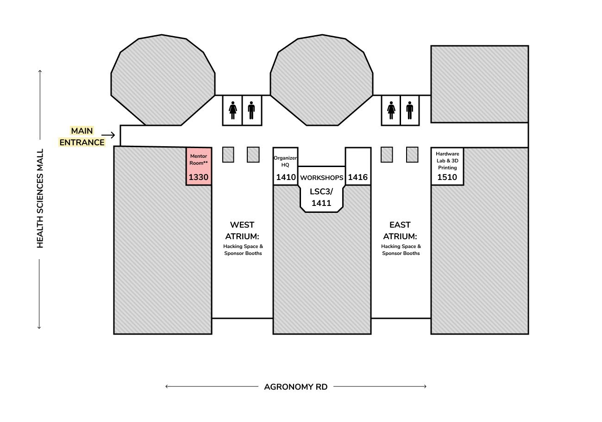
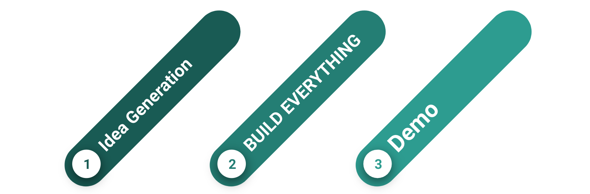

********************************************
My Journey a a Mentor at nwHacks 2020
********************************************

How did I get into this?
=============================================

TODO: Add story here

he shift you signed up for is (Jan.11th / 1:00 PM - 6:00 PM, Jan.11th / 5:00 PM - 9:00 PM, Jan. 11th / 8:00 PM - 12:00 AM, Jan. 12th / 12:00 AM - 6:00 AM, Jan. 12th / 6:00 AM - 10:00 AM, Jan. 12th / 9:00 AM - 1:00 PM, Jan. 12th / 12:00 PM - 4:00 PM), with plenty of breaks and activities.

    Venue with mentor booth.

Preparation
=============================================

Articles and Blogposts to read

* General
    * `nwHacks Website <https://www.nwhacks.io/>`_
    * `Facebook <https://www.facebook.com/events/2298151673622863/?active_tab=about>`_
    * `Info Package <https://www.notion.so/nwplus/nwHacks-Sponsor-Mentor-Info-Package-PUBLIC-3b7d752e95a042a88de7eb4303f4b9a4>`_
* Mentoring
    * `Mentoring 101 (Medium Article) <https://medium.com/nwplusubc/mentoring-101-your-guide-to-hackathons-349045d9fbe9>`_
    * `How to be the perfect mentor at a hackathon <https://medium.com/perfektio/https-medium-com-perfektio-how-to-be-the-perfect-mentor-at-a-hackathon-709e0ab2d032>`_

My takaway from the Articles
-----------------------------------------------

**Why am I here?**

#. Domain expert: Computer Vision, Edge devices, ML, Data Science
#. Role at company: Technical expert, PM, Internal Projects Lead
#. Technology: Python/ C/C++ / Linux / Embedded / AWS / Azure

**What are the challanges**

**Shortened dev process**

    Typical development workflow at a hackathon.

Source `Mentoring 101 (Medium Article) <https://medium.com/nwplusubc/mentoring-101-your-guide-to-hackathons-349045d9fbe9>`_

Judging
=======================================================

* 14 rows with 168 Projects
* Using Gavel
    * Pariwise comparison
    * Try not to skip projects
* Judging criteria
    * Technology: Algorythms, problem complexity, approach
    * Design:
        * Visual
        * Human/Machine interaction
        * Privacy
    * Completion
        * Finished / rough
    * Do not jusged on
        * Pitch
        * Economic viability

